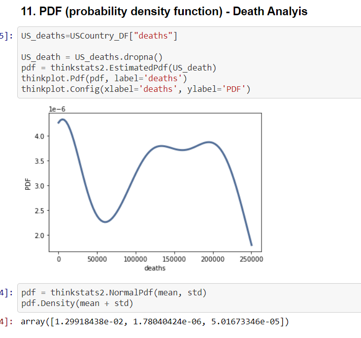
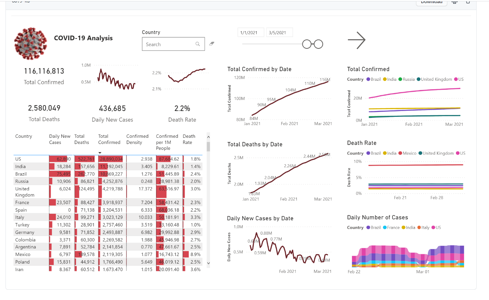
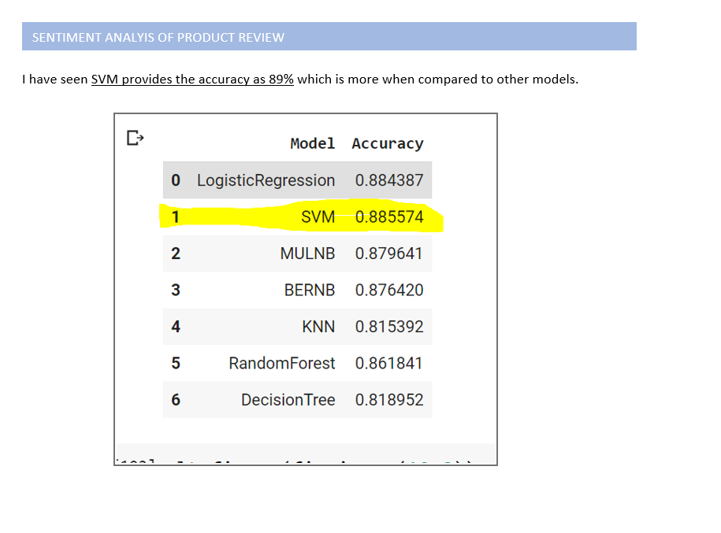

# Welcome to my portfolio.

I'm a Strong Data Analytics professional (Data Architect) with a Master of Science - MS focused in Data Science from Bellevue University.  As part of MS Program, I have specialized in Machine Learning, Data Mining, Exploratory Data Analysis, Visualization, Python and Big Data.

I’m looking forward to apply various techniques of the power of Artificial Intelligence, Machine Learning  and Big Data on Predictive Reporting and Analytics / AI projects, machine learning, and applications of data science.

The higher level focus of the Master of Science in Data Science as below

  1. Prepararation of datasets for solving problems.
  2. Recommendatio of appropriate data modeling techniques to test hypotheses.
  3. Communicatation of data science results into answers for domain challenges.
  4. Identify ethical considerations in dataset preparation and modeling.

---

## Statistics for Data Science 

### 1. Avocado Price Prediction - R

[Github Location](https://github.com/RGunasekaran21249030/DSC520-new/tree/master/assignments/Final%20Project)

My Project intends to thoroughly exploratory data analysis of the avocado prices increase along with customer behavior. The Data comes from Kaggle which is provided by Hass Avocado Board website compiled into a one CSV file and the data contains from 2015 to 2018 Avocado Purchases in the USA. The Project also tries to analyze the price elasticity of demand and find the comparison of conventional and organic avocados since Organic consumption is increasing in recent days.

This project developed by using R Programming. Also I have used various stastics related regression Linear, Multi-Linear Techniques and various visulization techniques.

----

## Introduction to Programming ( Python )
### 2. The Weather App - Python

[Github Location](https://github.com/RGunasekaran21249030/DS510_Week2_1)

In this semester worked on the various Python functions and learnt the programatic approaches in Python. As part of the Weather App using python.

---

## Data Exploration and Analysis
### 3. COVID19 EDA - Trends and Outbreak of Spread in USA - Python

[Github location](https://github.com/RGunasekaran21249030/DS530-RGunasekaran/tree/master/Final%20Project)

Develop COVID19 Data Tracker Tool with Key Performance Indicators (KPI), Trends, Geographic and Various visualizations, Prediction of CoronaVirus in the USA by using COVID19 Datasets and Python Programming Language. As part of this Proejct, I have used various stastics related distribution like PDF, CDF, PMF.

This project developed by using Python Programming.

---

## Data Preparation
### 4. Indicators of World Development and COVID19 Impacts - Python and Power BI

[Github location](https://github.com/RGunasekaran21249030/DSC540/tree/master/Week%2011%20%26%2012)

The aim of the Project is to analysis to answer interesting questions about the world development indicators and COVID19 Impacts dataset that was provided by the World Bank.

This project developed by using Python Programming.

---
### 5. US Election prediction - R

[Github location](https://github.com/RGunasekaran21249030/DSC540/tree/master/Week%2011%20%26%2012)

Data consolidated Kaggle and Twitter API. The model used was very basic approaches. After this semester, I have learnt about model performance and testing options. Hence this project work can be re-visited and applied all the new features and make this prediction work very well. 

This project developed by using R Programming.

---

## Data Mining

### 6. Customer Review Analysis and Recommendations - Python
[Github location](https://github.com/RGunasekaran21249030/DSC550/tree/master/Week%2010)

I have done some Sentimental Analytics and NLTP techniques to perform the Customer Review and Recommendation of Product Analysis. I have performed EDA Very well and implemented all the necessary best practices. Data used from Amazon and Kaggle. Out of 6 models, SVM performed well

## Predictive Analytics

### 7. The Application of Predictive Analytics on COVID 19 Cases and Deaths - Time Series
[Github location](https://github.com/RGunasekaran21249030/DSC630)

I have built Time Series ARIMA Model to the Application of Predictive Analytics on COVID 19 Cases and Deaths USA and India.

---

Page template forked from <a href="https://github.com/RGunasekaran21249030/RagunathGuasekaran.github.io">Ragunath Gunasekaran </a>

<!-- Remove above link if you don't want to attibute -->

---

Reference <a href="https://github.com/evanca/quick-portfolio"> portfolio</a>

<!-- Remove above link if you don't want to attibute -->

